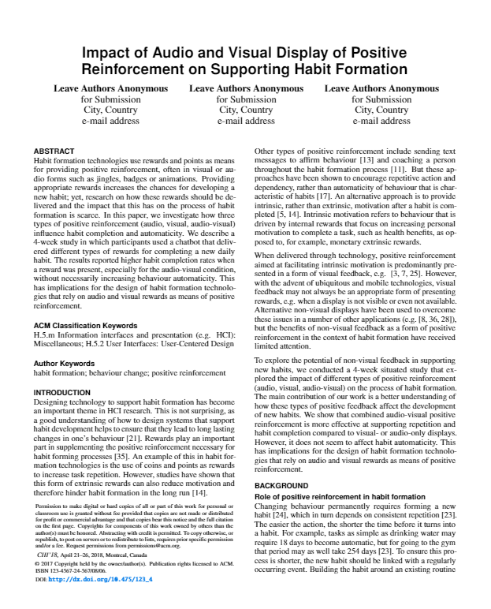

### [CHI](https://chi2018.acm.org/) 2018 paper

Impact of Audio and Visual Display of Positive Reinforcement on Supporting Habit Formation

    

Submitted to [ACM CHI 2018](https://chi2018.acm.org/) - Conference on Human Factors in Computing Systems, using the [CHI 2018 template](https://chi2018.acm.org/chi-proceedings-format/).

Accompanied by my MSc [thesis](https://github.com/harrymt/harryshabits-thesis) and [Harry's Habits](https://github.com/harrymt/harryshabits) - the chatbot that delivered the positive reinforcement.

#### Implementation

- [Thesis](https://github.com/harrymt/masters-thesis): My Masters Thesis written at the University of Bristol.
- [ChatBot](https://github.com/harrymt/harryshabits): Facebook Messenger Chatbot
- This paper is in version control, download [the latest release](https://github.com/harrymt/harryshabits-chi/releases) and upload the project into a new [Overleaf](https://www.overleaf.com) project and compile.
